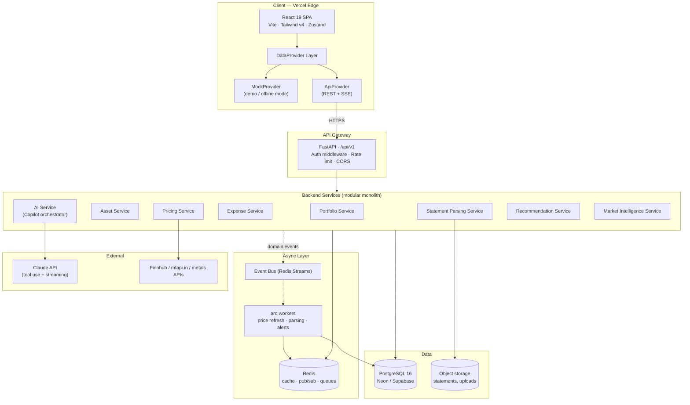
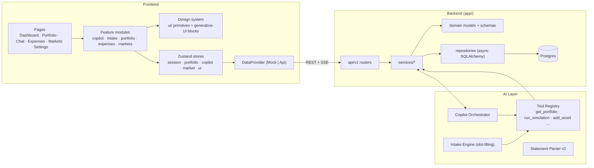

# 01 — System Architecture

## High-Level Architecture

**Key decision — modular monolith, not microservices.** At this stage (and even at 100k users), one FastAPI deployable with strictly bounded internal modules beats microservices on every axis: latency, cost, operational load, migration coordination. Service boundaries are enforced at the *package* level (no cross-module ORM imports; communication via service interfaces and domain events) so extraction to separate deployables later is mechanical. See 09 for the extraction triggers.

## Detailed Component Diagram

## Enterprise Architecture Principles

1. **AI as an orchestration layer, not a feature.** The AI Service holds no business logic; it translates natural language into typed tool calls against the same services the REST API uses. One source of truth for every calculation.
2. **Contract-first.** Pydantic schemas generate the OpenAPI spec; frontend types are generated from it (`openapi-typescript`). The `DataProvider` interface is the frontend's single contract — Mock and Api implement it identically.
3. **Event-driven where it pays.** Domain events (`asset.created`, `statement.parsed`, `price.updated`, `alert.triggered`) go to Redis Streams; workers consume for enrichment, valuation snapshots, and notifications. Synchronous request path stays simple.
4. **Everything async.** asyncpg + SQLAlchemy async sessions, httpx, SSE streaming. No sync I/O on the request path.
5. **Degrade gracefully.** Pricing provider down → serve last cached price with `stale: true`. Backend down → frontend flips to MockProvider with a visible "demo data" banner. Claude down → copilot returns tool-only deterministic answers where possible.

## Request Flows

**Copilot question** ("How diversified am I?"):
`SPA → POST /api/v1/copilot/chat (SSE) → Orchestrator → Claude (tool use) → tool: get_allocation → Portfolio Service → Postgres → Claude composes answer + chart block spec → SSE tokens + UI blocks → chat renders chart in-message`

**Conversational asset add**:
`SPA → POST /copilot/intake (SSE) → Intake Engine slot-filling loop (entity extraction → symbol/ISIN lookup → missing-field question) → user confirms card → tool: create_asset → Asset Service → event asset.created → worker enriches (sector, ISIN, live price) → portfolio recalc`

**Statement upload**:
`SPA → POST /statements (multipart, multi-file) → S3 → job queued (arq) → detect type → extract (pdfplumber/pandas/vision) → Claude normalize → dedupe/match vs holdings → confidence-scored review set → user confirms low-confidence rows → bulk create → event`
