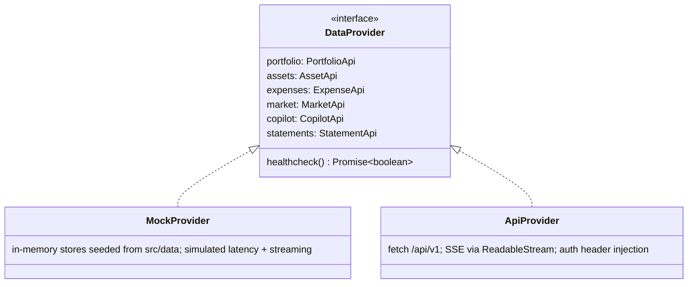

# 02 — Frontend Architecture

## Principles

- **Feature-sliced structure.** `features/` owns UX + local state per domain; `components/ui` is a pure design system; `providers/` is the only place that knows where data comes from.
- **Mock and Live are the same app.** `DataProvider` interface, selected at boot via `VITE_DATA_MODE=mock|api` and auto-fallback: if `ApiProvider.healthcheck()` fails, flip to Mock with a "Demo data" banner.
- **Generative UI.** Chat messages are not strings — they're a sequence of typed blocks (`text | chart | table | asset_card | portfolio_widget | confirm_card | prompt_suggestions`) rendered by a block registry. The backend streams block specs; the frontend owns rendering.
- **TS strict everywhere.** Migrate remaining `.jsx` (AssetDetailPage, HouseholdPortfolioView, expense components) to `.tsx`. API types generated from OpenAPI.

## Target Folder Structure

```
vite-project/src/
├── app/                        # App shell
│   ├── App.tsx
│   ├── router.tsx              # react-router (lazy routes)
│   └── providers.tsx           # DataProvider ctx, theme, error boundary
├── components/
│   └── ui/                     # Design-system primitives ONLY (retain + extend)
│       ├── Button.tsx  Card.tsx  Badge.tsx  Input.tsx  Sheet.tsx
│       ├── CommandPalette.tsx  # ⌘K omnibox (new)
│       └── Skeleton.tsx  Toast.tsx  Glass.tsx
├── features/
│   ├── copilot/                # AI chat — the product's spine
│   │   ├── CopilotDock.tsx     # slide-over panel, available on every page
│   │   ├── CopilotPage.tsx     # full-screen chat
│   │   ├── blocks/             # generative-UI block renderers
│   │   │   ├── BlockRenderer.tsx      # registry: type → component
│   │   │   ├── ChartBlock.tsx  TableBlock.tsx  AssetCardBlock.tsx
│   │   │   ├── ConfirmCardBlock.tsx   # intake confirmation
│   │   │   └── PromptSuggestions.tsx
│   │   ├── useCopilotStream.ts # SSE hook (fetch + ReadableStream)
│   │   └── store.ts            # conversation state (Zustand)
│   ├── intake/                 # Conversational asset onboarding
│   │   ├── IntakeChat.tsx      # embedded in Portfolio "Add via AI"
│   │   ├── ReviewCard.tsx      # AI-prefilled editable confirm card
│   │   └── useIntake.ts
│   ├── portfolio/              # retain existing components, move here
│   │   ├── PortfolioPage.tsx  Header/  AllocationTable/  AssetList/
│   │   ├── AssetDetailPage.tsx (from .jsx)
│   │   ├── forms/              # 10 forms — now the manual fallback
│   │   └── custom-asset/       # AI-assisted custom asset wizard
│   ├── expenses/               # retain, migrate to .tsx
│   ├── markets/                # watchlist, alerts, earnings calendar (new)
│   └── advisor/                # InvestmentAdvisor (retain)
├── providers/                  # ★ DataProvider abstraction (scaffolded)
│   ├── types.ts                # DataProvider interface + DTOs
│   ├── MockProvider.ts         # wraps existing mock data/services
│   ├── ApiProvider.ts          # REST + SSE client
│   └── index.ts                # factory + health-based fallback
├── stores/                     # cross-feature Zustand stores
│   ├── portfolioStore.ts  uiStore.ts  sessionStore.ts  marketStore.ts
├── lib/                        # helpers, formatters, api-client, sse
├── types/                      # generated OpenAPI types + domain types
└── data/                       # existing mock datasets (retained, typed)
```

## DataProvider Layer (mock ↔ live)



Rules:

1. Components never call `fetch` or import mock data directly — only through the provider from context.
2. `MockProvider.copilot.chat()` streams scripted block sequences for the demo prompts (diversification, SIP simulation, worst performers) so the full generative-UI chat works offline.
3. Mutations in mock mode persist to memory for session realism (add asset via intake works end-to-end in demo).
4. Provider selection: `VITE_DATA_MODE=api` + healthcheck fail → toast + fallback to mock; a pill in the header shows `LIVE` / `DEMO`.

## State Management

| Store | Scope | Notes |
|---|---|---|
| `sessionStore` | auth token, user, data mode | persisted (localStorage) |
| `portfolioStore` | holdings, summary, allocation | server-cache style: `stale`/`refreshing` flags; invalidated by copilot mutations |
| `copilotStore` | conversations, streaming buffer, pending intake session | per-conversation block arrays |
| `marketStore` | watchlist, quotes, alerts | quote updates via SSE `/market/stream` |
| `uiStore` | theme, dock open, command palette | retain |

Recommendation: add **TanStack Query** for server state (caching, retries, invalidation) with the provider as the query function layer; Zustand keeps pure client state. This removes hand-rolled refresh logic in `PortfolioTab`.

## Streaming Chat (SSE) Frontend Contract

```
event: block_start   data: {"id":"b2","type":"chart"}
event: delta         data: {"id":"b1","text":"Your portfolio is..."}
event: block         data: {"id":"b2","type":"chart","spec":{...vega-lite-ish spec...}}
event: suggestions   data: {"prompts":["Show sector exposure","Rebalance ideas"]}
event: done          data: {"conversation_id":"...","usage":{...}}
```

`useCopilotStream` parses SSE into the conversation's block array; React renders progressively. Charts render with Recharts from a neutral `ChartSpec` (type, series, axes) — never raw component props from the server.

## Performance Budget

Route-level code splitting (lazy pages), Recharts imported per-chart, < 200 KB gzip initial JS, LCP < 1.5s on Vercel edge, skeletons for every data panel, optimistic updates for asset CRUD.
