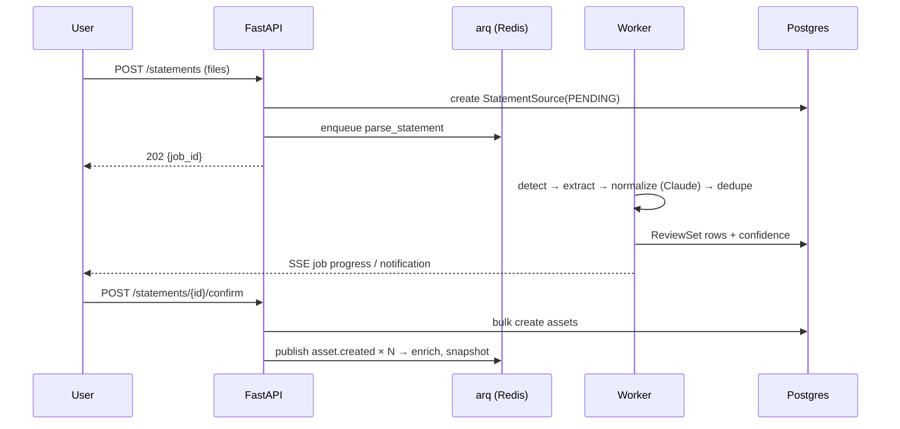

# 03 — Backend Architecture (FastAPI Modernization)

## Verdict on Current Backend

`models/` is excellent — retain as the core of the new `app/models/`. `api/portfolio.py` (1,047 lines: app + CORS + schemas + routes + logic in one file) gets decomposed. `statement_parser.py` and `valuation_service.py` become services with the logic preserved.

## Target Structure (modular monolith)

```
backend/
├── app/
│   ├── main.py                 # app factory, lifespan (DB, Redis, scheduler)
│   ├── core/
│   │   ├── config.py           # pydantic-settings, env-driven
│   │   ├── security.py         # JWT (access+refresh), password hashing
│   │   ├── deps.py             # get_db, get_current_user, rate limiter
│   │   └── events.py           # domain event bus (Redis Streams publisher)
│   ├── api/v1/
│   │   ├── router.py           # aggregates all routers under /api/v1
│   │   ├── auth.py  portfolio.py  assets.py  expenses.py
│   │   ├── copilot.py          # SSE chat + intake endpoints
│   │   ├── statements.py  market.py  recommendations.py
│   ├── models/                 # ← RETAINED SQLAlchemy models + new tables
│   ├── schemas/                # Pydantic v2 request/response per domain
│   ├── services/
│   │   ├── portfolio/          # aggregation, allocation, performance, XIRR
│   │   ├── asset/              # CRUD, lots, enrichment, custom assets
│   │   ├── pricing/            # ← valuation_service.py refactored; provider adapters
│   │   ├── expense/            # transactions, categorization
│   │   ├── ai/                 # orchestrator, tool registry, intake engine (see 04)
│   │   ├── statement/          # ← statement_parser.py refactored; pipeline stages
│   │   ├── recommendation/     # advisor rules + AI-ranked suggestions
│   │   └── market/             # watchlist, alerts, earnings, dividends
│   ├── repositories/           # async query layer per aggregate
│   ├── workers/
│   │   ├── worker.py           # arq worker settings
│   │   └── tasks/              # refresh_prices, parse_statement, snapshot_portfolio,
│   │                           # evaluate_alerts, enrich_asset
│   └── utils/
├── alembic/                    # migrations (init from current models)
├── tests/                      # pytest + pytest-asyncio; testcontainers-postgres
├── pyproject.toml              # uv; ruff + mypy
└── Dockerfile
```

## Service Boundaries

| Service | Owns | Exposes | Consumes events |
|---|---|---|---|
| Asset | assets + subtypes, custom assets, lots | CRUD, bulk create, enrichment | `statement.parsed` |
| Portfolio | summaries, snapshots, allocation, XIRR/ROI | summary, performance, exposure | `asset.*`, `price.updated` |
| Pricing | price providers, cache, history | quote(s), refresh | — (emits `price.updated`) |
| Expense | transactions, categories | CRUD, analytics | `statement.parsed` (bank) |
| AI | conversations, tool calls, intake sessions | SSE chat, intake | — (calls other services via interfaces) |
| Statement | uploads, parse jobs, review sets | upload, review, confirm | — (emits `statement.parsed`) |
| Recommendation | advisor plans, nudges | plan, suggestions | `portfolio.snapshot` |
| Market | watchlists, alerts, calendars, SIP tracker | watchlist CRUD, SSE quotes | `price.updated` |

Boundary rule: services import each other's **service interfaces**, never each other's repositories or ORM internals. Cross-cutting reactions go through events.

## Async & Event-Driven Design

- **DB:** `asyncpg` + SQLAlchemy 2 async sessions; one session per request via dependency.
- **Jobs:** **arq** (Redis-based, async-native, tiny) over Celery — Celery is overkill and sync-flavored. APScheduler inside the worker process handles cron (price refresh every 15 min market hours, daily snapshot, alert sweep).
- **Events:** Redis Streams with consumer groups. Emit after commit (outbox-lite: write event row in same tx, relay publishes — upgrade path noted in 09).
- **Cache:** Redis — quote cache (TTL by asset class, exactly as current valuation service does in-process), portfolio summary cache (invalidate on `asset.*`/`price.updated`), idempotency keys for uploads.



## Auth & Multi-Tenancy

- JWT access (15 min) + refresh (30 d, rotating) — httpOnly cookie on the API domain; `Authorization` header fallback for local dev.
- Every table already threads `household_id`/`user_id` — enforce via repository base class (all queries filtered by owner; no raw session use in routers).
- Rate limiting: slowapi/Redis — global per-IP + per-user AI budget (AI endpoints are the expensive ones: e.g. 60 copilot msgs/hour on free tier).

## Observability & Quality Gates

structlog JSON logs with request IDs; Sentry (API + workers); OpenTelemetry traces (FastAPI + SQLAlchemy + httpx instrumentation); `/healthz` (liveness) and `/readyz` (DB+Redis). CI gates: ruff, mypy, pytest with coverage floor, Alembic migration check (`alembic check` against models).
