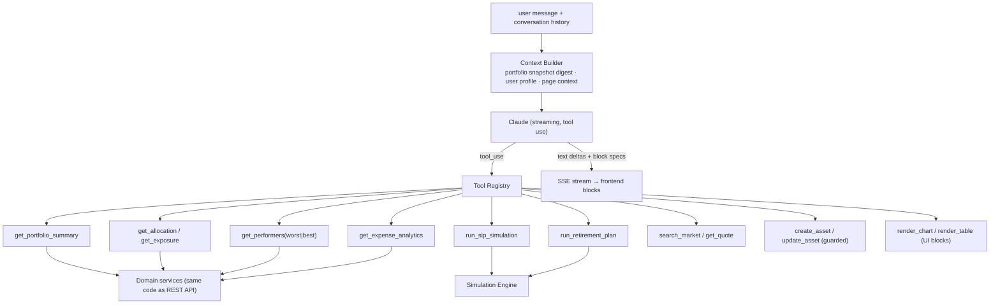
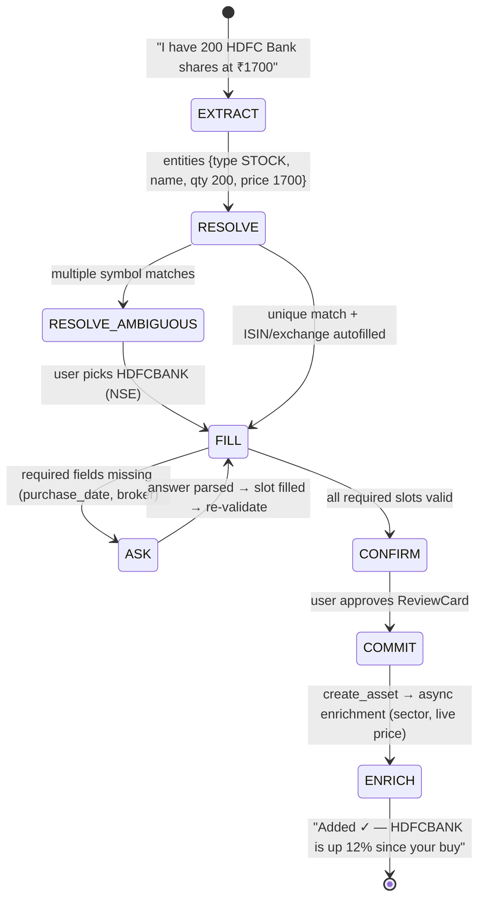
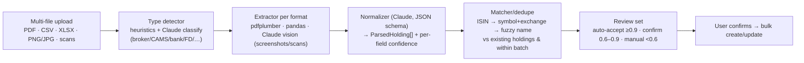

# 04 — AI Architecture

The AI layer is one orchestrator + a typed tool registry. Every AI feature (copilot Q&A, intake, custom assets, statement review, recommendations) is a *policy* over the same tools. The LLM never computes numbers — tools do; the LLM plans, extracts, and narrates.

## 1. Copilot Orchestrator

**Layers**

| Layer | Responsibility |
|---|---|
| Retrieval | Context Builder injects a compact portfolio digest (totals, allocation %, top/bottom 5, flags) into the system prompt — cheap, always fresh, no vector DB needed for structured data. Vector search (pgvector) only for unstructured memory: past conversations, notes, parsed statement text. |
| Portfolio intelligence | Deterministic analytics in `services/portfolio`: allocation, sector/geo exposure, concentration flags (reuse `warnConcentration` rules server-side), XIRR, dividend yield, financial health score (0–100 from savings rate, diversification, debt ratio, emergency fund). |
| Simulation engine | Pure functions, unit-tested: SIP compounding (monthly, step-up), goal funding, retirement corpus (inflation-adjusted SWR), lumpsum vs SIP, tax drag. Tools return series → `render_chart` block. |
| Recommendation engine | Rule layer (existing advisor logic: essential-category protection, debt-first) + AI ranking/narration on top. Rules decide *what's eligible*; AI decides *presentation and prioritization*. Always suffix SEBI-style "not investment advice" disclosure. |
| Risk engine | Concentration, liquidity-weighted exposure, volatility bucket per asset class, LTV flags, overlap detection between MFs/ETFs (index overlap table). |

**Guardrails:** mutating tools (`create_asset`, `update_asset`, `delete_asset`) always return a `confirm_card` block — execution happens only after an explicit user confirm round-trip (frontend sends `confirm_token`). AI budget per user via Redis counters. Prompt-injection defense: statement text and web content are wrapped as untrusted data, never as instructions.

## 2. AI Portfolio Intake Engine (conversational onboarding)

Slot-filling state machine, not free chat — the LLM does extraction and question generation; the state machine owns progress.

**Components**

- `IntakeSession` (persisted): `{session_id, asset_type?, slots: {field: {value, source: user|inferred|lookup, confidence}}, missing: [...], turn_count}`.
- **Extractor:** one Claude call with a JSON schema (`asset_mention`) → type inference, quantity/price/date parsing ("last Diwali" → date), Indian-format numbers ("1.5L", "₹1,700").
- **Resolver:** deterministic lookups — symbol search (NSE/BSE master list cached in Postgres), ISIN lookup, AMFI scheme search for MFs, exchange inference. Ambiguity → options list back to user.
- **Field policy:** per asset type, `required` / `recommended` / `optional` (mirrors existing form validation in `portfolioValidation`). The engine asks **one question per turn**, batching only trivially related fields ("Purchase date, and which broker?"). Hard cap ~6 turns, then offer the pre-filled manual form.
- **Validation:** same Pydantic schemas as the REST create endpoint — the intake engine cannot create anything the form couldn't.
- **ReviewCard:** every commit goes through an editable confirm card (generative-UI block) — AI fills, human approves. This is the trust anchor.

## 3. Custom Asset Engine

For anything outside the 10 predefined types: family business, startup equity, private lending, farmland, art, watches, crypto tokens, custom debt.

**Flow:** user describes asset → Claude classifies → `{category, risk_band (1–5), liquidity_score (1–10), valuation_method, suggested_schema: [field defs]}` → user reviews/edits suggested fields → asset created with `asset_type=CUSTOM` + JSONB attributes + stored schema.

Valuation methods: `MANUAL_MARK` (user updates value; staleness nudges after N months), `INDEXED` (grows by linked index, e.g. land ≈ inflation + x%), `FORMULA` (e.g. lending: principal × (1+r)^t), `EXTERNAL_QUOTE` (crypto via price API).

Schema (detail in 05): `custom_asset_types` (per-household reusable templates: name, category, risk, liquidity, valuation_method, field_defs JSONB) + `custom_assets` rows referencing a template with `attributes JSONB`. Portfolio aggregation treats them via `BroadCategory` mapping so allocation/net-worth stay consistent.

UX: "Add asset → Something else…" → one text box ("Describe it") → AI proposes a card: category, risk, liquidity, fields → user tweaks → done. Template saved for reuse ("Add another loan to a friend").

## 4. Chat Redesign — capabilities matrix

| Capability | Tools used | Output blocks |
|---|---|---|
| Portfolio Q&A | summary, allocation, performers | text, table, chart |
| Expense analysis | expense_analytics | chart (category pie), table |
| Market research | search_market, get_quote, web (curated) | text, asset_card |
| Investment & goal planning | sip_simulation, goal_plan | chart (projection), table |
| Wealth forecasting | net_worth_projection | chart |
| Tax insights | capital_gains_report (lot-level — the lot model already supports this) | table, text |
| Financial health | health_score | score widget |
| Asset discovery | screener (curated ETF/MF/stock lists from advisor data) | asset_card list |

Streaming, suggested prompts (server-sent, context-aware), follow-up chips after each answer, page-context injection (asking "why is this down?" on an asset page auto-scopes to that asset).

## 5. Statement Parser v2

Retain the existing 8-statement-type prompt logic as the normalizer core. New: password-protected PDF prompt-back, duplicate action choices (skip / new lot / update), idempotent re-upload via file hash, all runs as arq jobs with SSE progress.
