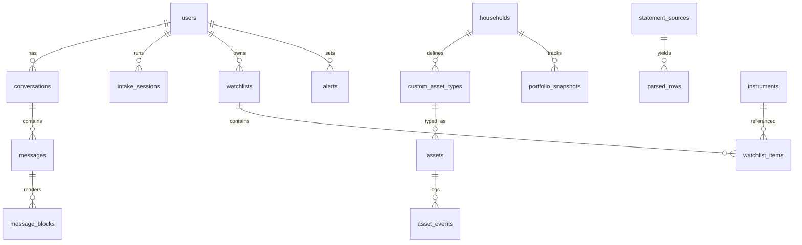

# 05 — Database Design (PostgreSQL 16)

**Retain:** the entire existing model set — `assets` + 10 joined-table subtypes, `price_history`, `portfolio_summary`, `users`, `households`, `statement_sources`. It's correct. Below are the **new** tables and the few alterations.

## Alterations to Existing Tables

- `assets`: add `entry_mode` value `AI_INTAKE`; add `enrichment_status` (PENDING/DONE/FAILED); add `custom_type_id UUID NULL → custom_asset_types`.
- `users`: add `auth_provider`, `password_hash`, `refresh_token_family`, `plan_tier`, `ai_message_quota`.
- `statement_sources`: add `file_hash` (idempotency), `storage_url`, `confidence_summary JSONB`.

## New Tables



```sql
-- AI conversation layer
conversations(id uuid PK, user_id FK, title text, page_context text,
              created_at, updated_at, archived bool)
messages(id uuid PK, conversation_id FK, role text CHECK (role IN ('user','assistant','tool')),
         content text, tool_calls jsonb, token_usage jsonb, created_at)
message_blocks(id uuid PK, message_id FK, seq int, type text,      -- text|chart|table|asset_card|confirm_card|score
               spec jsonb)                                          -- ChartSpec / TableSpec etc.

-- Conversational intake
intake_sessions(id uuid PK, user_id FK, status text,               -- ACTIVE|CONFIRMED|ABANDONED
                asset_type text NULL, slots jsonb,                  -- {field:{value,source,confidence}}
                missing text[], turn_count int, created_asset_id uuid NULL, created_at, updated_at)

-- Custom asset engine
custom_asset_types(id uuid PK, household_id FK, name text, category text,     -- maps to BroadCategory
                   risk_band int, liquidity_score int,
                   valuation_method text,                            -- MANUAL_MARK|INDEXED|FORMULA|EXTERNAL_QUOTE
                   valuation_config jsonb, field_defs jsonb,          -- [{key,label,type,required,options?}]
                   created_by_ai bool, created_at)
-- custom holdings live in `assets` (asset_type='CUSTOM') with attributes jsonb + custom_type_id

-- Market intelligence
instruments(id uuid PK, symbol text, exchange text, isin text UNIQUE NULL, name text,
            instrument_type text, sector text, industry text, meta jsonb)   -- NSE/BSE/AMFI master, seeds resolver
UNIQUE(symbol, exchange)
watchlists(id uuid PK, user_id FK, name text, sort int)
watchlist_items(id uuid PK, watchlist_id FK, instrument_id FK, added_at, note text)
alerts(id uuid PK, user_id FK, instrument_id FK NULL, asset_id FK NULL,
       kind text,                       -- PRICE_ABOVE|PRICE_BELOW|PCT_MOVE|PORTFOLIO_DROP|SIP_DUE|EARNINGS
       config jsonb, status text, last_triggered_at, created_at)
corporate_events(id uuid PK, instrument_id FK, kind text,           -- EARNINGS|DIVIDEND|SPLIT|BONUS
                 event_date date, payload jsonb)
dividends_received(id uuid PK, asset_id FK, amount numeric(18,4), pay_date date, source text)

-- Performance & analytics
portfolio_snapshots(id uuid PK, household_id FK, as_of date,
                    total_value numeric(18,4), total_invested numeric(18,4),
                    allocation jsonb, exposure jsonb, health_score int)
UNIQUE(household_id, as_of)             -- daily snapshot by worker; powers performance chart + AI context
asset_events(id uuid PK, asset_id FK, kind text, payload jsonb, created_at)  -- audit trail

-- Statement parsing v2
parsed_rows(id uuid PK, statement_id FK, raw jsonb, normalized jsonb,
            confidence numeric(3,2), match_asset_id uuid NULL,
            resolution text)            -- AUTO_ACCEPTED|CONFIRMED|SKIPPED|MERGED

-- Optional: pgvector for unstructured memory
memory_chunks(id uuid PK, user_id FK, kind text, content text, embedding vector(1024), meta jsonb)
```

## Indexing & Data Policy

- Hot paths: `assets(household_id, is_deleted)`, `price_history(asset_id, price_date DESC)`, `messages(conversation_id, created_at)`, `alerts(status, kind)`, `instruments` trigram index on `name` (fuzzy resolver).
- Money stays `NUMERIC(18,4)` (existing convention). All timestamps `timestamptz`.
- Snapshots are append-only; price history pruned to daily granularity after 90 days (worker).
- Row ownership enforced in the repository layer; optionally Postgres RLS at 100k-user stage (09).
- Migrations: Alembic from day one; the current models generate the initial revision.
