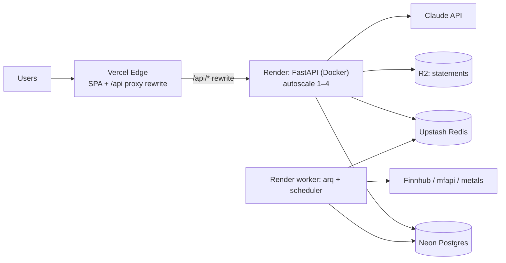

# 08 — Deployment Architecture

## Recommended Topology

| Tier | Choice | Why |
|---|---|---|
| Frontend | **Vercel** (Netlify equivalent-fine) | Edge CDN, preview deploys per PR, zero config for Vite |
| API | **Render** (start) → **Fly.io** (scale) | Render: simplest Docker deploy + managed background workers. Fly wins later on multi-region (Mumbai region `bom` matters for Indian users) |
| Workers | Same image, `arq` process type on Render | One artifact, two processes |
| Postgres | **Neon** (or Supabase) | Serverless PG 16, branches for preview envs, pgvector available |
| Redis | **Upstash** | Serverless, per-request pricing, fits Render/Fly |
| Object storage | Cloudflare R2 | Zero egress fees for statement files |
| Monitoring | Sentry + Better Stack (uptime/logs) | |



**Same-origin trick:** Vercel rewrite `/api/:path* → https://api.tradingai.app/api/:path*` — no CORS in production, httpOnly cookies just work.

## Environments & Config

| Env | FE | API | DB |
|---|---|---|---|
| Preview (per PR) | Vercel preview | Render preview env | Neon branch (auto-created) |
| Staging | `staging.tradingai.app` | Render staging | Neon staging branch |
| Prod | `tradingai.app` | Render prod (min 2 instances) | Neon main |

Frontend env: `VITE_DATA_MODE`, `VITE_API_BASE`. Backend env (pydantic-settings, fail-fast on missing): `DATABASE_URL`, `REDIS_URL`, `ANTHROPIC_API_KEY`, `FINNHUB_KEY`, `JWT_SECRET`, `S3_*`, `SENTRY_DSN`, `ALLOWED_ORIGINS`. Secrets live in platform vaults only — never in repo; `.env.example` documents all keys.

## CI/CD (GitHub Actions)

```
PR → [FE] lint · tsc · vitest · contract tests vs MockProvider · build
   → [BE] ruff · mypy · pytest (testcontainers PG+Redis) · alembic check · docker build
   → Vercel preview + Render preview + Neon branch  → E2E smoke (Playwright vs preview)
main → build once → deploy staging → migrate (alembic upgrade, pre-deploy job)
     → smoke → promote to prod (manual gate) → migrate → health verify → auto-rollback on /readyz fail
```

Build strategy: Docker image built once per SHA, promoted across envs (no rebuild). FE build with source maps to Sentry. Migrations run as a release-phase job *before* new instances receive traffic; only additive migrations while old code is live (expand→migrate→contract pattern).

## Production Readiness Checklist

- [ ] `/healthz` + `/readyz` wired to platform health checks; graceful shutdown (uvicorn `--timeout-graceful-shutdown`)
- [ ] Alembic migration path from zero; seed script (instruments master, demo user)
- [ ] Structured logs w/ request IDs; Sentry on API, workers, FE
- [ ] Rate limiting live (per-IP + per-user AI quota); request size caps (uploads 25 MB)
- [ ] Backups: Neon PITR verified restore; R2 lifecycle rules
- [ ] Load test: 200 RPS read, 50 concurrent SSE streams sustained
- [ ] Error budget alarms: p95 latency, 5xx rate, worker queue depth
- [ ] MockProvider demo mode verified against latest contract

## Security Checklist

- [ ] JWT: short access TTL, rotating refresh, revocation list in Redis
- [ ] httpOnly + Secure + SameSite=Lax cookies; CSRF token on state-changing routes if cookie auth
- [ ] Ownership enforced in repository base (no cross-tenant reads); tests assert 404 on foreign IDs
- [ ] Upload hardening: MIME sniff, size cap, PDFs parsed in worker (not request path), files virus-scanned or sandboxed
- [ ] Prompt-injection: statement/web text wrapped as data; mutating tools require confirm_token; AI output never eval'd
- [ ] Secrets scanning (gitleaks) in CI; dependency audit (pip-audit, npm audit) weekly
- [ ] TLS everywhere; HSTS; CSP (no inline scripts; Recharts is fine)
- [ ] PII: statements encrypted at rest (R2 SSE), deleted on user request (GDPR/DPDP Act flow)
- [ ] Financial disclaimers on all recommendation surfaces (SEBI compliance posture)

## Cost (≈ MVP → 10k MAU)

| Item | MVP | 10k MAU |
|---|---|---|
| Vercel | $0 (hobby) | $20 |
| Render (API+worker) | $14 | ~$100 (2×std + worker) |
| Neon | $0 | $19–69 |
| Upstash | $0 | ~$20 |
| R2 | ~$0 | ~$5 |
| Claude API | usage | **the real cost** — cap via quotas; Haiku-class model for extraction/classification, Sonnet-class for copilot; cache portfolio-digest prompts (prompt caching); batch enrichment |
| Total infra | **< $20/mo** | **~$200/mo + AI usage** |

Cost levers: model routing by task (extractor ≠ copilot), prompt caching for system+digest, SSE instead of polling, quote cache TTLs, snapshot-based performance charts (no recompute).
